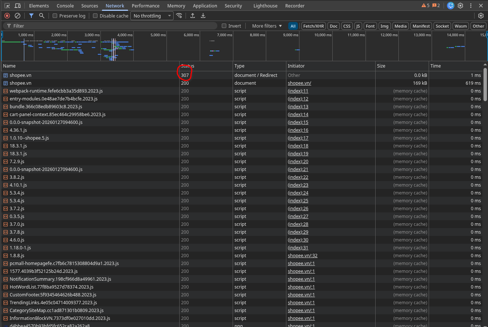
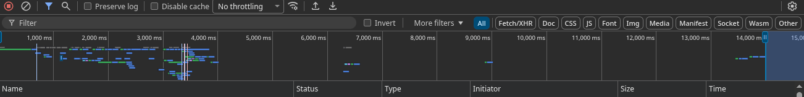
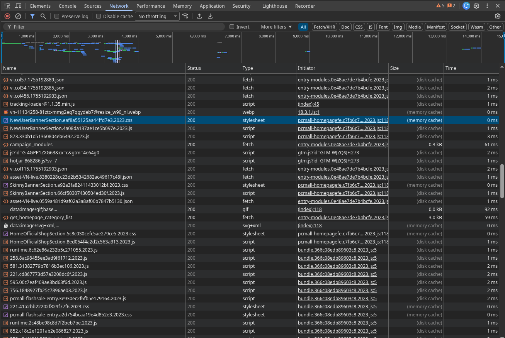

# PHIẾU TRẢ LỜI CÂU HỎI

## PHẦN A — KIỂM TRA ĐỌC HIỂU
### Câu A1
**Câu 1: các bước để truy cập vào trang `https://shopee.vn`**
1. Request xuất phát từ Laptop -> đi qua router Wifi nhà trọ
2. -> qua nhà mạng VNPT(Viettel, FPT,..) -> xuyên qua cáp quang
3. -> Đến data center của Shopee ở Singapore
4. -> Server nhận và xử lý request truy cập trang chủ
5. -> Respone chạy ngược lại: cáp quang -> VNPT -> Router -> Laptop
6. -> Trình duyệt nhận file HTML, CSS, JS -> render ra giao diện -> Nhìn thấy giao diện trên màn hình laptop.

**Nguồn tham khảo**: [tuan_1_html5/01_introduction_html_universe.md](https://github.com/ktzung/CCC_Frontend/blob/main/tuan_1_html5/01_introduction_html_universe.md)

**Câu 2**

Trong Devtools của chrome, tab **Network** cho thấy:
* Name
* Status
* Type
* Initiator
* Size
* Time

**Status code của request đầu tiên**

**Tổng thời gian load trang**

**Request trả về file CSS**
