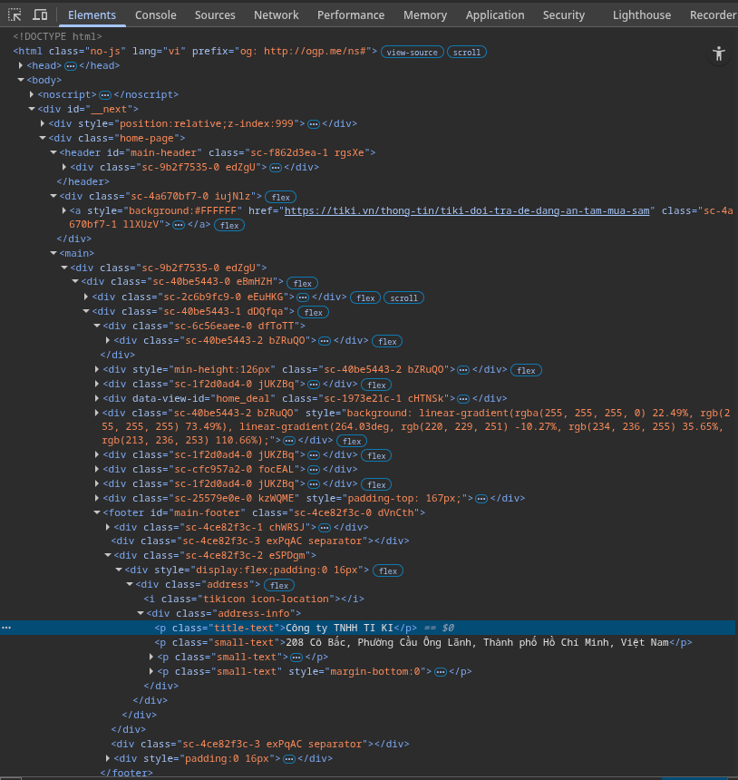

# PHIẾU TRẢ LỜI CÂU HỎI

## PHẦN A — KIỂM TRA ĐỌC HIỂU
### Câu A1 - HTTP & Browser
**Câu 1: các bước để truy cập vào trang `https://shopee.vn`**
1. Request xuất phát từ Laptop -> đi qua router Wifi nhà trọ
2. -> qua nhà mạng VNPT(Viettel, FPT,..) -> xuyên qua cáp quang
3. -> Đến data center của Shopee ở Singapore
4. -> Server nhận và xử lý request truy cập trang chủ
5. -> Respone chạy ngược lại: cáp quang -> VNPT -> Router -> Laptop
6. -> Trình duyệt nhận file HTML, CSS, JS -> render ra giao diện -> Nhìn thấy giao diện trên màn hình laptop.

**Nguồn tham khảo**: [tuan_1_html5/01_introduction_html_universe.md](https://github.com/ktzung/CCC_Frontend/blob/main/tuan_1_html5/01_introduction_html_universe.md)

**Câu 2**

Trong Devtools của chrome, tab **Network** cho thấy:
* Name
* Status
* Type
* Initiator
* Size
* Time

**Status code của request đầu tiên**


**Tổng thời gian load trang**


**Request trả về file CSS**


### Câu A2 - Semantic HTML

#### 1. Tại sao trang web bị Google đánh giá SEO thấp?

Trang web mắc lỗi lạm dụng thẻ `<div>`. Thẻ `<div>` là thẻ trung tính, không mang ý nghĩa nội dung. Điều này khiến bộ máy tìm kiếm của Google không xác định được đâu là nội dung chính, đâu là thanh điều hướng, dẫn đến việc xếp hạng thấp.

#### 2. Danh sách 4 lỗi semantic và cách sửa:

| STT | Lỗi hiện tại | Cách sửa | Ý nghĩa|
|-----|--------------|----------|--------|
| 1   | `<div class="header">` | `<header>` | xác định phần đầu trang. |
| 2   | `<div class="menu">` | `<nav>` | Khu vực thanh điều hướng |
| 3   | `<div class="main">` | `<main>` | Nội dung chính của trang. |
| 4   | `<div class="title">` | `<h1>` | Tiêu đề chính của trang. |
| 5   | `` | Thêm thuộc tính `alt="..."` | Giúp google hiển thị nội dung ảnh khi ảnh không hiển thị được |

#### 3. Đoạn mã sửa lại:
``` html
<header>
    <div class="logo">ShopTLU</div>
    <nav>
        <ul>
            <li><a href="/">Trang chủ</a></li>
            <li><a href="/products">Sản phẩm</a></li>
        </ul>
    </nav>
</header>
<main><header>
    <div class="logo">ShopTLU</div>
    <nav>
        <ul>
            <li><a href="/">Trang chủ</a></li>
            <li><a href="/products">Sản phẩm</a></li>
        </ul>
    </nav>
</header>
<main>
    <article class="product">
        <h1>iPhone 16 Pro</h1>
        <p class="price">25.990.000đ</p>
        <figure>
            
        </figure>
    </article>
</main>
<footer>© 2026 ShopTLU</footer>
    <article class="product">
        <h1>iPhone 16 Pro</h1>
        <p class="price">25.990.000đ</p>
        <figure>
            
        </figure>
    </article>
</main>
<footer>© 2026 ShopTLU</footer>
```

**Nguồn tham khảo**: [03_head_data_html.md](https://github.com/ktzung/CCC_Frontend/blob/main/tuan_1_html5/03_head_data_html.md), [04_visible_part_html.md](https://github.com/ktzung/CCC_Frontend/blob/main/tuan_1_html5/04_visible_part_html.md)
### Câu A3 — Block vs Inline

```
+-------------------------------------------------------+
| Hộp 1                                                                 | (Block chiếm hết 1 dòng)
+-------------------------------------------------------+
Text A Text B                                                        (Inline nằm cùng hàng)
+-------------------------------------------------------+
| Hộp 2                                                                | (Block chiếm hết 1 dòng)
+-------------------------------------------------------+
Text C Text D                                                       (Inline/Strong cùng hàng)
+-------------------------------------------------------+
| Hộp 3                                                                | (Block chiếm hết 1 dòng)
+-------------------------------------------------------+
```
* Thẻ Block (`<div>`): Luôn bắt đầu trên một dòng mới và kéo dài đến hết chiều rộng màn hình.
* Thẻ Inline (`<span>, <strong>`): Chỉ chiếm chiều rộng bằng chính nội dung của nó và không tạo dòng mới.
**Nguồn tham khảo**: [02_basic_structure_html.md](https://github.com/ktzung/CCC_Frontend/blob/main/tuan_1_html5/02_basic_structure_html.md)
### Câu A4 — Table
#### 1. Phân biệt các thẻ:
* `<thead>`: Nhóm các nội dung tiêu đề.
* `<tbody>`: Nhóm các nội dung dữ liệu chính của bảng.
* `<tfoot>`: Nhóm các nội dung tổng kết hoặc thông tin bổ sung.
#### Tại sao KHÔNG NÊN dùng table để tạo layout?
1. **Khả năng truy cập (Accessibility)**: Trình đọc màn hình sẽ đọc bảng theo hàng/cột, gây rối loạn cho người khiếm thị khi họ chỉ muốn đọc nội dung trang web.

2. **Hiệu suất (Performance)**: Trình duyệt phải tính toán toàn bộ kích thước bảng trước khi hiển thị, khiến trang tải chậm hơn.

3. **Không linh hoạt (Responsive)**: Bảng rất khó để co giãn hoặc chuyển đổi cấu trúc khi xem trên thiết bị di động (Mobile).

**Nguồn tham khảo**: [05_tables_hyperlinks.md](https://github.com/ktzung/CCC_Frontend/blob/main/tuan_1_html5/05_tables_hyperlinks.md)
## PHẦN B — THỰC HÀNH CODE
### Bài B1 — Trang Profile cá nhân (profile.html)
**File**: [profile.html](profile.html)
### Bài B2 — Trang Sản phẩm E-Commerce
**File**: [products.html](products.html)
### Bài B3 — Debug HTML
* Lỗi 1: Dòng 1: Thiếu html trong `<!DOCTYPE>` → Sửa thành `<!DOCTYPE html>`.
* Lỗi 2: Dòng 4: Thẻ `<title>` chưa đóng → Thêm `</title>`.
* Lỗi 3: Dòng 5: Thuộc tính charset viết sai chuẩn utf8 → Sửa thành UTF-8.
* Lỗi 4: Dòng 8: Thẻ đóng `<h1>` viết sai `<h1>` → Sửa thành `</h1>`.
* Lỗi 5: Dòng 12: Thẻ `<a>` đóng sai `<a>` → Sửa thành `</a>`.
* Lỗi 6: Dòng 19: Thẻ `` thiếu thuộc tính alt.
* Lỗi 7: Dòng 21: Thẻ `<b>` đóng sau thẻ `<p>` (sai thứ tự nesting) → Đóng `</b>` trước.
* Lỗi 8: Dòng 40: Có 2 thẻ `<main>` → Đổi thẻ thứ 2 thành `<aside>` hoặc `<div>`.
* Lỗi 9: Dòng 26: Thẻ `<table>` thiếu cấu trúc `<thead>/<tbody>`.
* Lỗi 10: Dòng 42: Thẻ `<p>` trong footer chưa đóng → Thêm `</p>`.

**File**: [debug.html](debug.html)

### Bài B4 - Phân tích trang web thật
#### Phân tích trang web tiki.vn

**Hình ảnh**:


**3 Thẻ semantic được sử dụng đúng:**

1. `<header id="main-header">`: Được dùng để bao bọc phần đầu trang (logo, thanh tìm kiếm).

2. `<main>`: Thẻ này bao bọc toàn bộ nội dung chính của trang web, giúp công cụ tìm kiếm xác định khu vực nội dung quan trọng nhất.

3. `<footer> id="main-footer"`: Được dùng để chứa các thông tin liên hệ và chính sách ở cuối trang.

**2 Thẻ chưa tối ưu semantic (Dùng <div> thay thế):**

1. Khu vực khuyến mãi: Đoạn `<div data-view-id="home_deal">` lẽ ra nên được thay bằng thẻ `<section>` để chỉ rõ đây là một phân đoạn nội dung riêng biệt.

2. Vị trí của Footer: Trong ảnh, thẻ `<footer>` đang bị nằm sâu bên trong nhiều lớp thẻ `<div>` và thẻ `<main>`. Thông thường, footer chính của trang nên là con trực tiếp của thẻ `<body>` hoặc nằm ngoài `<main>` để phân tách rõ ràng cấu trúc.

#### Phân tích thẻ table

*Không tìm thấy layout table trên trang tiki.vn*

#### 3. Phân tích thẻ <form> (Thanh tìm kiếm)

**Action và Method:**

Action: /search (đường dẫn xử lý tìm kiếm).

Method: get (vì từ khóa tìm kiếm sẽ hiển thị trên URL, ví dụ: tiki.vn/search?q=iphone).

**Input types được dùng:**

type="text": Dành cho ô nhập từ khóa.

## PHẦN C — SUY LUẬN
### Câu C1 — Thiết kế cấu trúc
``` html
<header> <!--Dùng để bọc các yếu tố mang tính giới thiệu hoặc điều hướng toàn cục của trang web-->
    <nav aria-label="Main Navigation"> <!-- nav vì nó là thanh điều hướng-->
        <ul>
            <li><a href="/">Trang chủ</a></li>
            <li><a href="/products">Sản phẩm</a></li>
        </ul>
    </nav>
</header>

<main> <!--main vì nó là nơi chứa nội dung chính của trang-->

    <nav aria-label="breadcrumb"> <!--Thanh điều hướng nên dùng nav-->
        <ol>
            <li><a href="/">Trang chủ</a></li>
            <li><a href="/mobile">Điện thoại</a></li>
            <li>iPhone 16</li>
        </ol>
    </nav>

    <article class="product-detail"> <!--article vì nó một sản phẩm độc lập-->
        
        <section class="gallery"> <!--section vì nó là một phần nội dung của sản phẩm-->
            <figure> <!--figure là phần ghi chú nội dung-->
                
                
                <figcaption>Hình ảnh thực tế iPhone 16</figcaption> <!--figcaption phần ghi chú-->
            </figure>
        </section>

        <section class="purchase-info">
            <h1>iPhone 16 128GB</h1>
            
            <p class="price">Giá: <strong>22.990.000đ</strong></p>
            
            <div class="rating">⭐⭐⭐⭐⭐ (500 đánh giá)</div>

            <section class="desc">
                <h2>Mô tả sản phẩm</h2>
                <p>iPhone 16 sở hữu chip A18 với hiệu năng vượt trội...</p>
            </section>
        </section>

        <section class="specs">
            <h2>Thông số kỹ thuật</h2>
            <table>
                <tbody>
                    <tr>
                        <th scope="row">Màn hình</th>
                        <td>6.1 inch</td>
                    </tr>
                </tbody>
            </table>
        </section>

        <section class="reviews">
            <h2>Bình luận từ khách hàng</h2>
            <article class="comment">
                <p><strong>Nguyễn Văn A:</strong> Máy rất đẹp, giao hàng nhanh!</p>
            </article>
        </section>

    </article>

    <aside class="sidebar"> <!--aside phần nội dung có liên quan đến sản phẩm-->
        <h3>Sản phẩm tương tự</h3>
        <ul>
            <li><a href="/iphone-16-pro">iPhone 16 Pro</a></li>
        </ul>
    </aside>

</main>

<footer> <!--Cung cấp thông tin về tác giả, trang web, bản quyền,...-->
    <p>&copy; 2026 ShopTLU. All rights reserved.</p>
</footer>
```

### Câu C2 — So sánh & Tranh luận

Quan điểm dùng `<div>` cho mọi thứ để tiết kiệm thời gian học thẻ mới là một tư duy khá phổ biến, vì đúng là chúng ta có thể tạo ra giao diện y hệt nhau bằng CSS. Tuy nhiên, dưới góc độ kỹ thuật web hiện đại, đây là một thói quen gây hại cho chất lượng dự án. Học vài thẻ semantic không làm tốn thời gian, mà thực chất là cách làm việc thông minh hơn. Thứ nhất, về mặt SEO (Tối ưu hóa công cụ tìm kiếm): Các bot của Google bị "mù" giao diện, chúng chỉ hiểu nội dung thông qua mã HTML. Khi bạn dùng thẻ `<main>` hay `<article>`, bạn đang trực tiếp nói với Google rằng: "Đây là nội dung quan trọng nhất, hãy ưu tiên lập chỉ mục nó". Nếu chỉ dùng `<div class="content">`, robot sẽ coi khối đó ngang hàng với mọi khối `<div>` vô nghĩa khác, khiến thứ hạng trang web sụt giảm. Thứ hai, về Accessibility (Khả năng truy cập): Người khiếm thị sử dụng trình đọc màn hình (Screen Readers) để lướt web. Công cụ này được lập trình để nhận diện các điểm neo ngữ nghĩa. Nó có thể giúp người dùng nhảy phím tắt thẳng đến thẻ `<nav>` (menu) hoặc `<footer>`, nhưng sẽ hoàn toàn vô dụng và bắt người dùng phải nghe đọc từng dòng một trong một "ma trận" toàn thẻ `<div>`.

**Một ví dụ cụ thể:** Nếu bạn tự chế một nút bấm bằng `<div class="btn" onclick="...">`, bạn sẽ phải tự viết thêm code Javascript để bắt sự kiện phím Enter/Space, tự thêm thuộc tính tabindex để điều hướng bằng bàn phím, tự thêm aria-role. Trong khi đó, chỉ cần dùng đúng thẻ `<button>`, trình duyệt đã tích hợp sẵn toàn bộ những tính năng đó. Việc dùng `<div>` trong trường hợp này thực chất mới là thứ làm bạn tốn thời gian hơn.